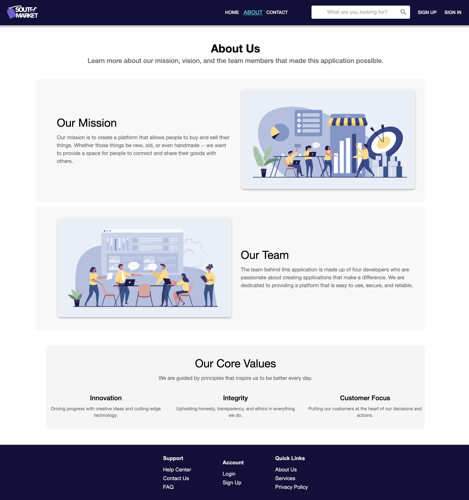
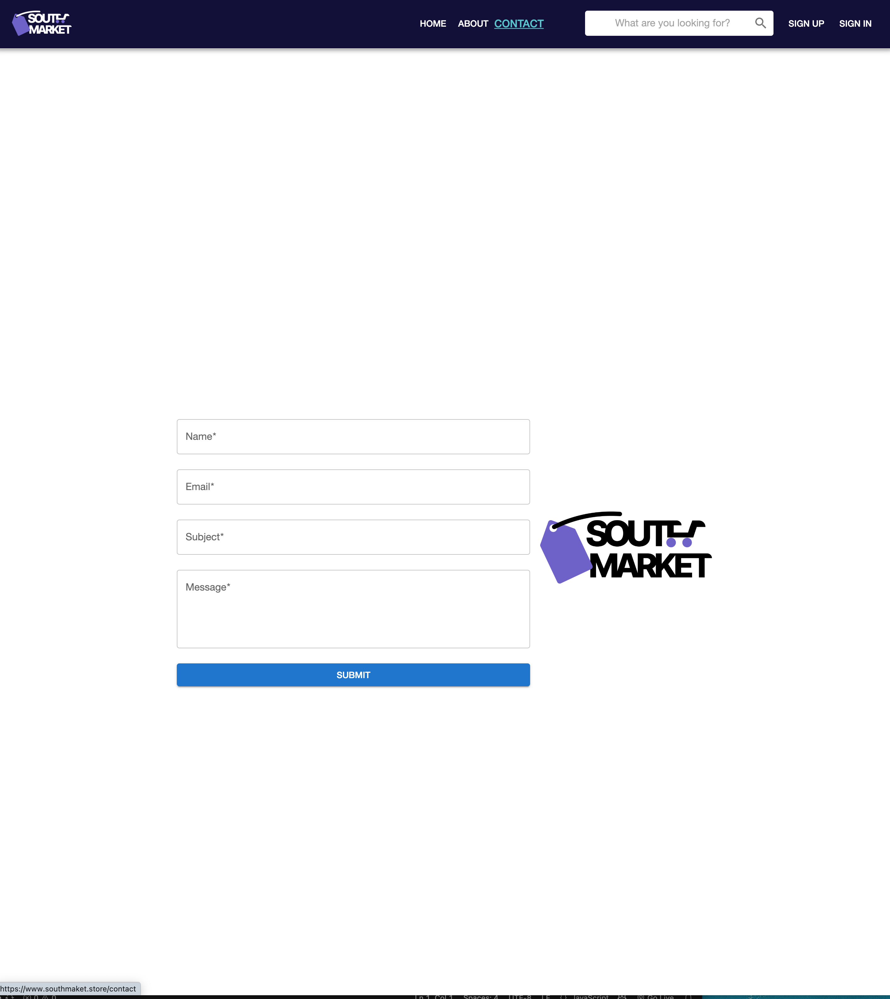
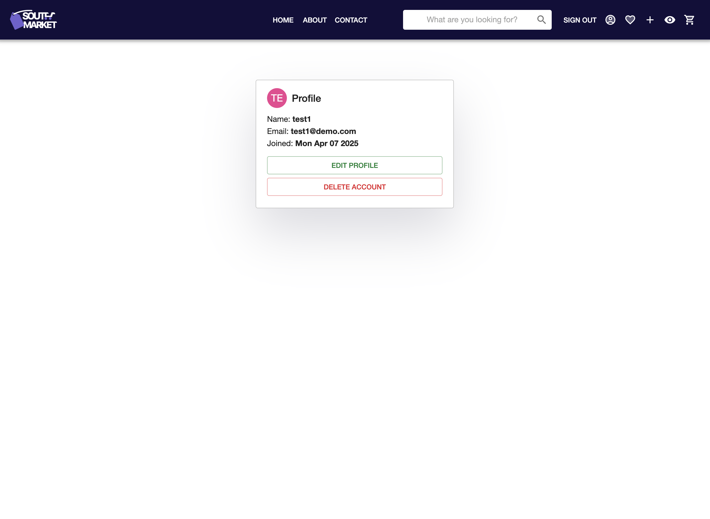
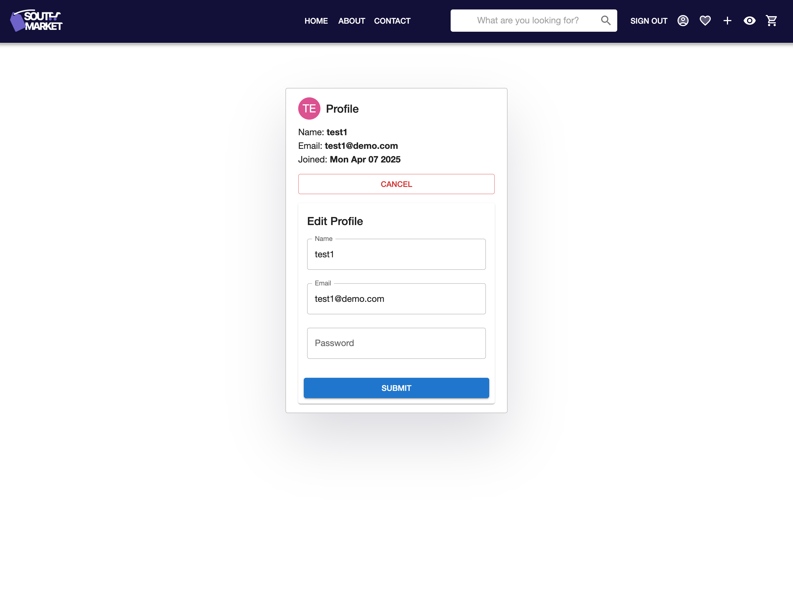
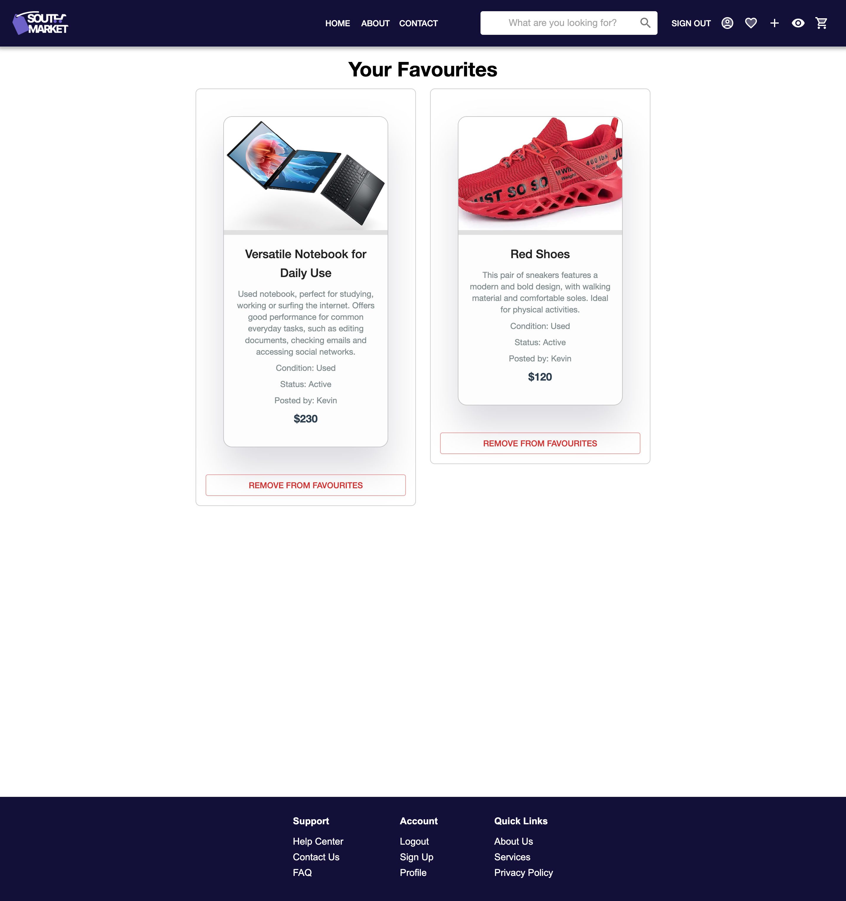
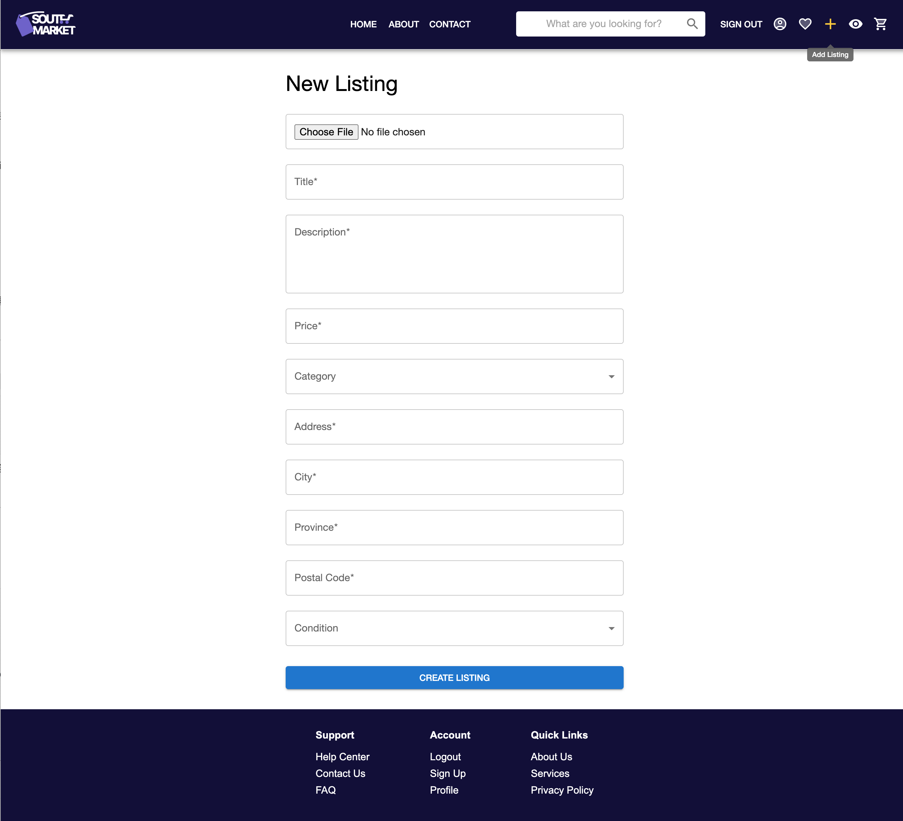
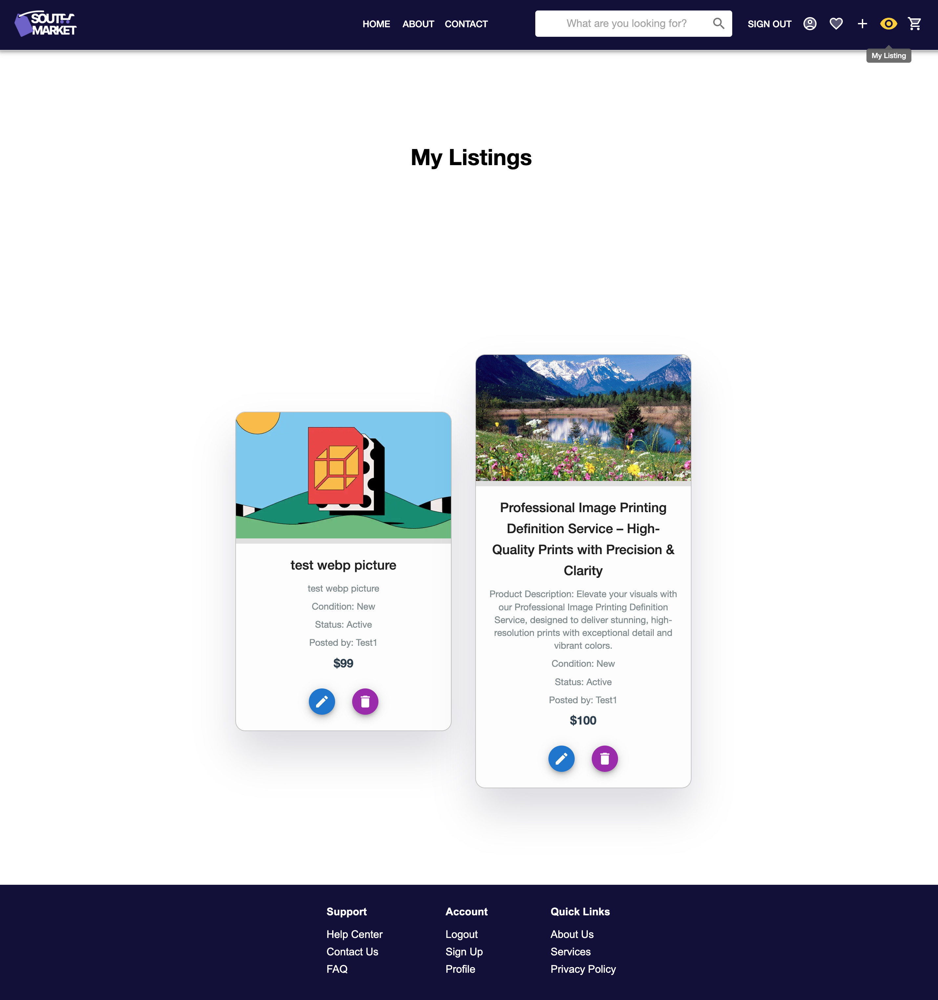
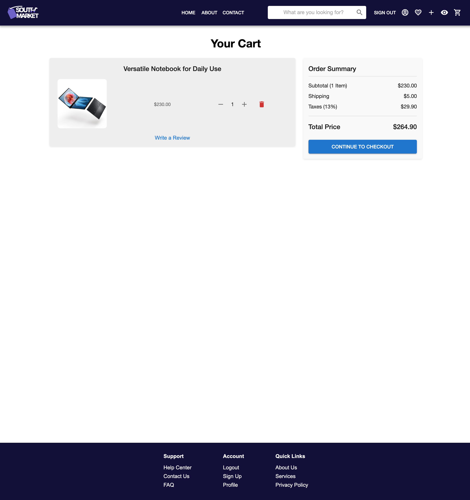

# README

edit merge

## Website Screenshot 

## 网页

<table>
  <tr>
    <td> 1.2 Homepage</td>
    <td> 1.4 Product</td>
  </tr>
  <tr>
      <td> 1.1 About Us</td>
    <td> 1.3 Contact</td>
  </tr>
</table>

---

## 用户相关页面

<table>
  <tr>
    <td> 2.1 Login</td>
    <td> 2.2 Signup</td>
  </tr>
  <tr>
    <td> 2.3 Profile</td>
    <td> 2.4 Profile Edit</td>
  </tr>
  <tr>
    <td> 2.5 Favorites</td>
    <td> 2.6 New Listing</td>
  </tr>
  <tr>
    <td> 2.7 My Listings</td>
    <td> 2.8 Cart</td>
  </tr>
</table>
